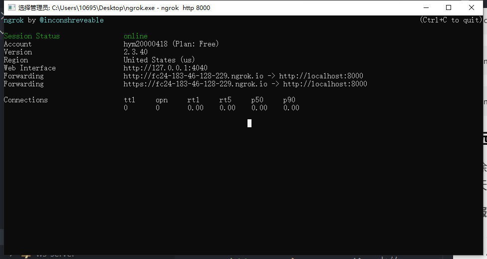

# websocket聊天室

#### 🚀 基于WebSocket协议的多人聊天室

PS：目前正在开发阶段，预计实现功能：
1. 发送文本（完成）。
2. 发送图片（完成）。
3. 发送语音（完成）。
4. 语音通话。
5. 视频通话。
6. 发送位置。
7. 夜间模式（完成）。
8. 入群提示（完成）。
9. 消息提示。

#### 🚦 启动服务

```
$ git clone https://github.com/18023785187/ws.git
```

启动浏览器服务
```
$ cd ws_client
$ npm install
$ npm run start
```

启动服务器服务
```
$ cd ws_service
$ npm install
$ npm run start
```

#### 🛠️ 远程聊天ngrok

除了部署服务器外还可以使用内网穿透的方式令外网访问本地服务器，实现远程聊天。

###### 服务器

1. 下载ngrok https://ngrok.com/download 。
2. window直接解压。
3. 在ngrok官网上注册账号，获取token，在终端调用命令 `ngrok authtoken your_token`，这里的your_token是你在ngrok获取的token。
4. 在ws_service目录下执行`npm run start`启动本地服务器。
5. 打开ngrok.exe执行`ngrok http 8000`，Forwarding中的url就是外网可访问的地址了。


###### 客户端

客户端有现成的url链接，直接访问即可。
https://ws-eight.vercel.app/

如果两者都使用ngrok，那么可以配置多隧道代理
1. 找到生成的ngrok.yml `C:\Users\用户/.ngrok2/ngrok.yml`。
2. 修改ngrok.yml。
3. 在终端执行命令 `ngrok start --all(启动所有端口)` 或 `ngrok start tunnel1 tunnel2 (启动指定端口)`。


#### 📄 说明

1. 该聊天室使用websocket协议，对于http协议请使用ws协议，https协议使用wss协议。
2. 对于聊天记录存储使用的是indexedDB。

#### 🖖 效果展示


